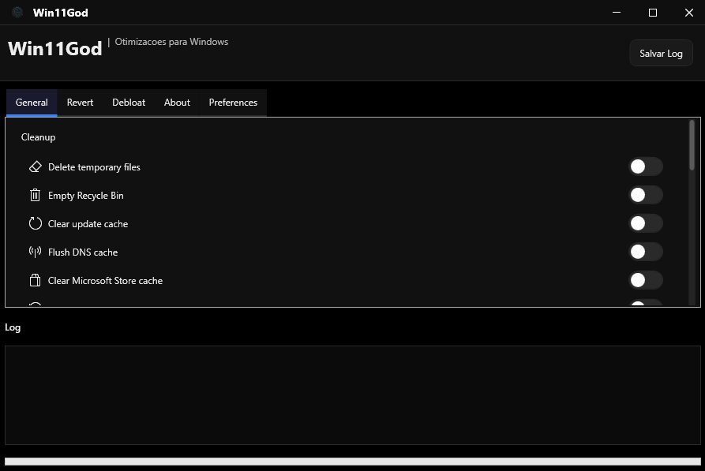

<div align="center">


# Win11God

**A Windows 11‑style performance & debloat dashboard built in PowerShell + WPF.**

[](https://learn.microsoft.com/powershell/)
[](#)
[](#)
[](#)
[](#)

</div>

> **Straightforward. Reversible. Fast.**
>
> Win11God centralizes safe Windows tweaks (cleanup, privacy, UX trimming) with one UI. Every change logs to a panel and most actions have one‑click **Revert**.

---

## ✅FAST USE 
1. Open Powershell as Administrator
2. Run this command: ```irm "https://amathyzin.com.br/win11god" | iex```
3. Have fun!

## ✨ Highlights

* 🪟 **Native Win11 look** — custom titlebar, Mica/Acrylic backdrop, dark theme.
* 🚀 **One‑click optimizations** — Temp cleanup, Recycle Bin empty, Windows Update cache purge, DNS flush, Store reset, Recent files cleanup.
* 🧩 **Performance toggles** — Disable Fast Startup, reduce Telemetry, trim UI animations, disable Game Bar/DVR, Widgets, tips, background apps, Copilot.
* 🧼 **Debloat panel** — Remove bloat UWP apps (Candy Crush, Xbox suite, Skype, Groove, Movies & TV, News, Weather, Maps, 3D Viewer, etc.).
* 🛟 **Safety first** — Optional **Restore Point** before applying and **Revert** actions (e.g., re‑enable Fast Startup, telemetry, services, taskbar/start menu defaults).
* 🌐 **Built‑in i18n** — UI in **Português / English / Español** with runtime switch & persisted preference.
* 📝 **Live log + Save** — Full on‑screen log and export to file.

---

## 📸 UI Preview

<p align="center">
  
</p>

---

## 📦 Requirements

* **Windows 11** (designed for) — also works on **Windows 10** with caution (fallbacks in place)
* **PowerShell 5.1+** (preinstalled on Windows) or **PowerShell 7+**
* **Administrator privileges** for most system tweaks (the app can run without, but some actions will be skipped)

---

## 🛠️ Setup & Run

> No external installers. Just clone and run the script. If you prefer a dry run, use `-NoElevation` and **Simulate** buttons.

```powershell
# 1) Clone this repository
# 2) Start PowerShell as Administrator (recommended)
# 3) Run the main script

Set-ExecutionPolicy Bypass -Scope Process -Force
./Win11God.ps1

# Optional: run without auto‑elevation (useful for testing)
./Win11God.ps1 -NoElevation
```

> **Note**: Execution policy is temporarily relaxed **only for the current session** in the snippet above.

---

## 🧭 Features Overview

### General → Cleanup

* Delete temporary files (User + System Temp)
* Empty Recycle Bin
* Clear Windows Update cache
* Flush DNS cache
* Reset Microsoft Store cache
* Clear Recent Files & Jump Lists

### General → System & Performance

* Disable **Fast Startup** (and **Reactivate** in Revert)
* Reduce **Telemetry** to minimum allowed (and **Revert**)
* Disable **Game Bar/DVR**
* Reduce **UI animations**
* Enable **Storage Sense** defaults
* Disable **suggestions & tips**
* Disable **Widgets**
* Disable **background apps**
* Disable **Copilot** (Win11 23H2+)

### Debloat (Apps & Services)

* Remove UWP bundles: **Candy Crush**, **Xbox suite**, **Skype**, **Groove**, **Movies & TV**, **News**, **Weather**, **Maps**, **3D Viewer**, etc.
* Heavy services (advanced): **Windows Search indexing**, **Fax**, **Tablet Input**, **SysMain (Superfetch)**, **Cortana related**

### Revert

* Reactivate **Fast Startup**
* Revert **Telemetry** settings
* Restore disabled **services** and default UI behaviors (taskbar, start menu, context menu)

---

## 🌍 Languages

The UI ships with **Português (pt)**, **English (en)**, and **Español (es)**. On first run you can pick a language; your choice is saved to `%APPDATA%/Win11God/language.json`.

---

## 🔐 Security & Transparency

* **No installers**; pure script. Readable PowerShell code with explicit registry/service changes.
* **Admin check** with clear warnings when actions might fail without elevation.
* **Logging** to an on‑screen console with timestamps; optional **Save Log**.
* **Restore Point** option to allow system rollback via Windows System Restore.

> Tip: Review the code before running. You’re in control.

---

## 🧪 Development

* **Stack**: PowerShell + WPF (XAML), custom Win32 interop (Mica/Acrylic), runspaces for responsive background tasks.
* **Structure**: UI (XAML) + logic functions (cleanup, debloat, revert, i18n, logging) in a single script for easy auditing.

### Useful Developer Flags

```powershell
# Start without auto‑elevating (keeps same console)
./Win11God.ps1 -NoElevation
```

---

## 🤝 Contributing

PRs are welcome. Keep changes **auditable** and **reversible**. If you add a new tweak:

* Include **log messages**, **i18n strings**, and **Revert** when applicable.
* Prefer **policies/registry** over external binaries.
* Document the rationale in the PR description.

---

## 🧾 License

This project is open source. See **LICENSE** for details.

---

## 📣 Credits

Built by **aMathyzin**. Portfolio: [https://amathyzin.xyz](https://amathyzin.xyz)

---

## ⚠️ Disclaimer

You use these tweaks at your own risk. Although this tool favors safe defaults and provides reversion paths, environments vary. Create a restore point or backup before major changes.
